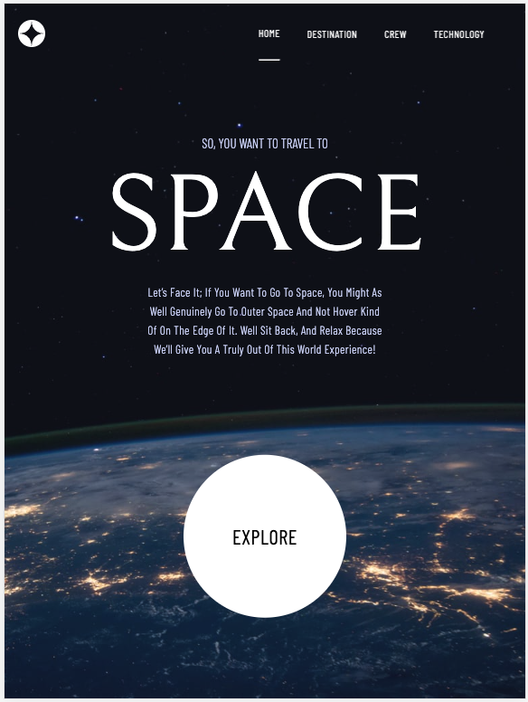

# Frontend Mentor - Space tourism website solution

This is a solution to the [Space tourism website challenge on Frontend Mentor](https://www.frontendmentor.io/challenges/space-tourism-multipage-website-gRWj1URZ3). Frontend Mentor challenges help you improve your coding skills by building realistic projects.

## Table of contents

- [Overview](#overview)
  - [The challenge](#the-challenge)
  - [Screenshot](#screenshot)
  - [Links](#links)
- [My process](#my-process)
  - [Built with](#built-with)
  - [What I learned](#what-i-learned)
  - [Continued development](#continued-development)
  - [Useful resources](#useful-resources)
- [Author](#author)
- [Acknowledgments](#acknowledgments)

## Overview

This application was created with NextJs, Typescript and tailwind mainly. The idea was to apply my knowledge in Tailwind which is a technology that I am looking to improve.

### The challenge

I tried to replicate the provided Figma design using good coding practices to make it more readable, maintainable and scalable.

### Screenshot

### Links

- Solution URL: [Here](https://github.com/LEstebanR/FM_Space_Tourism)
- Live Site URL: [Here](https://fm-space-tourism-iota.vercel.app/)

## My process

### Built with

- [Next.js](https://nextjs.org/)
- Tailwind
- Typescript

### What I learned

- I reinforced my knowledge of Tailwind.
- I got to know NextJS App Router

### Continued development

Feedback is welcome

### Useful resources

- [Next Js](https://nextjs.org/docs)
- [Tailwind documentation](https://tailwindcss.com/docs/installation)
- [CSS Tricks](https://css-tricks.com/snippets/css/a-guide-to-flexbox/)

## Author

- Website - [lesteban.dev](https://www.lesteban.dev/)
- Frontend Mentor - [@LEstebanR](https://www.frontendmentor.io/profile/LEstebanR)

## Acknowledgments

Thank you Frontend Mentor.
